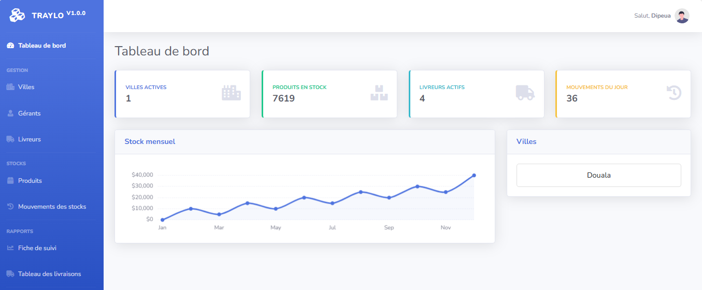

# Traylo – Gestion de Stock et Distribution

**Traylo** est une application web développée pour gérer le stock central et sa distribution dans les différentes villes. Elle permet de suivre les produits depuis l’entrepôt jusqu’aux livreurs, tout en générant des rapports de fichiers Excel automatiquement.

## Fonctionnalités principales

### 1. Gestion des villes

- Ajouter, modifier et supprimer des villes.
- Associer des livreurs à une ville.
- Accès : uniquement pour les administrateurs.

### 2. Gestion des gérants

- Ajouter et gérer des comptes gérants par ville.
- Chaque gérant peut voir uniquement les stocks et livraisons de sa ville.
- Accès : Administrateurs pour créer les gérants, gérants pour consulter/modifier leurs données.

### 3. Gestion des livreurs

- Ajouter, modifier et supprimer des livreurs.
- Suivi de leurs mouvements de produits (entrées, sorties, stock initial, stock final).
- Affectation à une ville spécifique.
- Accès : Administrateurs pour tout, gérants pour leur ville.

### 4. Gestion des produits

- Ajouter et modifier des produits disponibles.
- Suivi des stocks par produit et par ville.
- Accès : Administrateurs seulement.

### 5. Gestion des stocks

- Suivi des entrées, sorties et stock final pour chaque produit.
- Historique des mouvements par livreur et par ville.
- Tableau de bord avec visualisation graphique des stocks journaliers.
- Accès : Administrateurs (toutes les villes) et gérants (ville locale).

### 6. Fiche de suivi / Rapports

- Sélection d’un livreur pour voir ses mouvements de stock.
- Édition des entrées, sorties et calcul automatique du stock final.
- Enregistrement des données modifiées pour que le livreur conserve ses informations.
- Export des rapports en fichier Excel.
- Accès : Administrateurs et gérants (selon ville).

### 7. Tableau des livraisons

- Affichage dynamique des livraisons par produit, ville et livreur.
- Totaux calculés automatiquement.
- Export Excel avec structure dynamique et bordures.
- Accès : Administrateurs et gérants.

### 8. Droits d’accès et sécurité

- Admin : accès complet à toutes les villes, produits, livreurs et rapports.
- Manager/Gérant : accès limité à sa ville pour consulter et modifier les stocks et livraisons.
- Authentification sécurisée via login.
- Déconnexion via modal.

### 9. Export et reporting

- Génération de fichiers Excel pour :
    - Tableau des livraisons par produit, ville et livreur.
    - Fiches de suivi des mouvements de stock.

- Les fichiers suivent la structure dynamique des tableaux affichés dans l’application.
- Bordures et fusion des cellules pour un rendu clair et professionnel.

### 10. Interface utilisateur

- Basée sur Bootstrap 5 pour un design responsive.
- Sidebar dynamique indiquant la page active.
- Tableaux éditables pour modification directe des stocks.
- Graphiques pour visualisation des mouvements de stock journaliers (optionnels).
