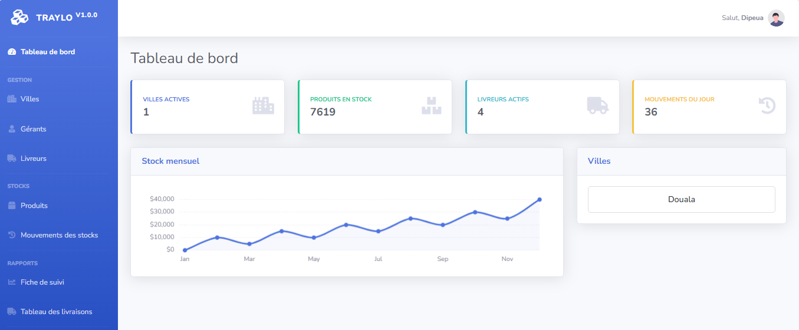

# Traylo – Gestion de Stock et Distribution

**Traylo** est une application web développée pour gérer le stock central et sa distribution dans les différentes villes. Elle permet de suivre les produits depuis l’entrepôt jusqu’aux livreurs.
